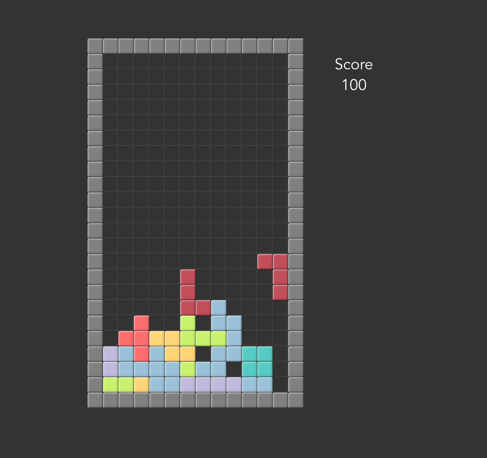

# Falling Blocks

This is a Falling Blocks game made with [Vue](https://vuejs.org/) and [Vuex](https://vuex.vuejs.org/).

## Screenshot



## Getting Started

## Install dependencies.

```
yarn install
```

In the project directory, you can run:

## Running the app

```
yarn serve
```

Runs the app in the development mode.<br>
Open [http://localhost:8080](http://localhost:8080) to view it in the browser.

## See it running

Got to [https://carlosyslas.com/falling-blocks](https://carlosyslas.com/falling-blocks).
